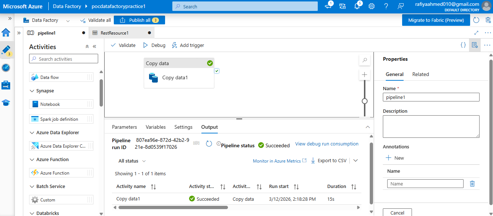

# Azure Data Factory REST API Ingestion Pipeline

## Project Overview

This project demonstrates the development of a cloud-based ETL pipeline using **Azure Data Factory (ADF)** to ingest, store, and transform data from an external REST API source.

The pipeline extracts user information from the **ReqRes REST API** using Azure Data Factory **Copy Activity**, stores the raw data in **Azure Blob Storage**, and applies basic data cleansing transformations using Python.

This project focuses on building the foundation of a scalable data engineering workflow by implementing the **data ingestion layer** and a basic **transformation layer**.

---

# Architecture

## Implemented Pipeline

```
                 REST API
              (ReqRes API)
                    |
                    |
                    ▼
          Azure Data Factory
             Copy Activity
                    |
                    |
                    ▼
          Azure Blob Storage
          Bronze Layer (Raw Data)
                    |
                    |
                    ▼
          transformations.py
        Data Cleansing Layer
                    |
                    |
                    ▼
          Clean Processed Dataset
```

## Pipeline Screenshot



---

# Data Source

## REST API

Endpoint:

```
https://reqres.in/api/users?page=2
```

The ReqRes API provides sample user information in JSON format.

Example response:

```json
{
    "id": 1,
    "email": "george.bluth@reqres.in",
    "first_name": "George",
    "avatar": "https://reqres.in/img/faces/1-image.jpg"
}
```

---

# Data Destination

## Azure Blob Storage

The extracted API data is stored in Azure Blob Storage.

Storage details:

| Property        | Description             |
| --------------- | ----------------------- |
| Storage Service | Azure Blob Storage      |
| Data Layer      | Bronze Layer (Raw Data) |
| File Format     | Delimited Text          |

Example output:

```
1,george.bluth@reqres.in,George,https://reqres.in/img/faces/1-image.jpg
```

---

# Data Fields Extracted

| Field      | Description            |
| ---------- | ---------------------- |
| id         | Unique user identifier |
| email      | User email address     |
| first_name | User first name        |
| avatar     | User profile image URL |

---

# Technologies Used

## Azure Services

* Azure Data Factory
* Azure Blob Storage

## Data Engineering Tools

* REST API Integration
* ETL Pipeline Development
* Data Transformation
* Data Lake Architecture Concepts

## Azure Data Factory Components

* Copy Activity
* Linked Services
* Datasets

## Programming

* Python

## Data Formats

* JSON
* Delimited Text

---

# Pipeline Workflow

The pipeline executes the following steps:

### 1. API Connection

Azure Data Factory connects to the ReqRes REST API using an HTTP linked service.

### 2. Data Extraction

ADF sends a GET request to the API endpoint and receives user data in JSON format.

### 3. Data Ingestion

Azure Data Factory Copy Activity extracts the required fields:

```
id
email
first_name
avatar
```

### 4. Data Storage

The extracted data is converted into a delimited text format and stored in Azure Blob Storage.

### 5. Data Transformation

The raw data is processed using Python transformations to improve data quality and prepare it for downstream usage.

---

# Transformation Layer (Implemented)

The `transformations.py` script performs basic data cleansing operations on the extracted dataset.

Implemented transformations:

| Transformation        | Description                                    |
| --------------------- | ---------------------------------------------- |
| Remove whitespace     | Removes unnecessary spaces from text fields    |
| Email standardization | Converts email addresses into lowercase format |
| Name formatting       | Converts names into proper case                |
| Duplicate removal     | Removes duplicate records                      |
| Data validation       | Handles missing or invalid values              |
| Metadata enrichment   | Adds source system and load timestamp          |

---

# Transformation Example

## Before Transformation

| id | email                                       | first_name |
| -- | ------------------------------------------- | ---------- |
| 1  | [GEORGE@REQRES.IN](mailto:GEORGE@REQRES.IN) | george     |

## After Transformation

| user_id | email                                       | first_name | source_system | load_date  |
| ------- | ------------------------------------------- | ---------- | ------------- | ---------- |
| 1       | [george@reqres.in](mailto:george@reqres.in) | George     | ReqRes API    | 2026-07-11 |

---

# Future Production Enhancements

The current project implements REST API ingestion and basic transformation logic.

The following enhancements can extend this solution into a production-scale data engineering platform.

## Advanced Transformation

* Azure Data Factory Mapping Data Flow
* Azure Databricks with PySpark
* Delta Lake implementation
* Advanced data quality checks

## Data Lake Architecture

Future layered architecture:

```
REST API
   |
   ▼
Azure Data Factory
   |
   ▼
Azure Blob Storage
Bronze Layer
   |
   ▼
Transformation Layer
ADF Data Flow / PySpark
   |
   ▼
Silver Layer
Cleaned Data
   |
   ▼
Gold Layer
Analytics Data
   |
   ▼
Power BI Reporting
```

## Pipeline Improvements

Planned enhancements:

* Configure ADF scheduled triggers
* Add pipeline monitoring and logging
* Implement retry and failure handling
* Add automated validation checks
* Implement CI/CD deployment practices

---

# Security

Sensitive information is not stored in this repository.

Excluded:

* API credentials
* Azure connection strings
* Storage account keys
* Authentication details

---

# Repository Structure

```
AzureDataFactory_REST_API_Project

│
├── README.md
│   └── Project documentation
│
├── pipeline1.json.txt
│   └── Azure Data Factory pipeline definition
│
├── pipeline1.png
│   └── Azure Data Factory pipeline screenshot
│
└── transformations.py
    └── Python data cleansing transformations
```

---

# Project Outcome

This project demonstrates:

✅ REST API data ingestion using Azure Data Factory
✅ Cloud data storage using Azure Blob Storage
✅ ETL pipeline development using Copy Activity
✅ Python-based data cleansing transformations
✅ Azure service integration
✅ Data lake architecture concepts
✅ Foundation for scalable cloud data engineering solutions

---

# Author

**Rafiya Ahmed**

Azure Data Engineering Project
